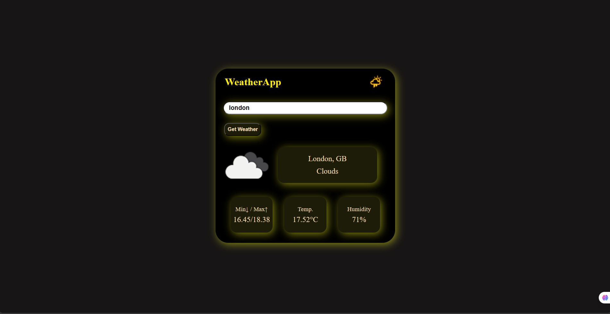

# 🌤️ Weather App

A simple and responsive **React Weather Application** that displays real-time weather information for any city using the **OpenWeatherMap API**.

---

## 🚀 Features

* 🌍 Search weather by city name
* 🌡️ Displays temperature, humidity, and weather condition
* 🖼️ Dynamic weather icons and background
* ⌨️ Press **Enter** key to search instantly
* 🎨 Clean and minimal UI 
* ⚡ Built with React Hooks (`useState`, `useEffect`)

---

## 🛠️ Tech Stack

* **React.js**
* **Axios** (for API requests)
* **OpenWeatherMap API**
* **CSS3**

---

## 📸 Preview

<<<<<<< HEAD
*Will add soon*
=======

>>>>>>> 82ff84d (added output picture)

---

## 🧠 Learning Outcomes

* Using APIs in React
* Handling asynchronous requests with `async/await`
* Managing component state with React Hooks
* Handling form input and user interaction
<<<<<<< HEAD
* Structuring a React project with clean and reusable components
=======
* Structuring a React project with clean and reusable components
>>>>>>> 82ff84d (added output picture)
